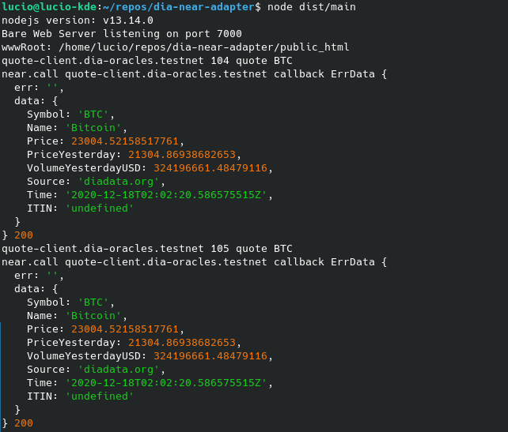

# DIA-NEAR-adapter

The dia-near adapter is a server process dedicated to fulfill requests posted on the smart contract `contract.dia.oracles.near` in the NEAR blockchain

Requests sent to `contract.dia.oracles.near` within the NEAR blockchain, are periodically polled, the data retrieved from [DIA endpoints](diadata.org), and then sent back to the contract requesting the data by a call to the specified callback function. e.g.
`near call [requestring-contract-account-id] [callback-method] { "err":"", "data":[dia-api-call-result] }`

## Example

*server up and resolving request_id 104 and 105 from quote-test-client.dia-test.testnet, asking for a DIA quote. Image shows incoming request and NEAR callback to originating contract*




## Technical details

This nodejs server is written in typescript. 

It polls requests by periodically calling `get_pending_requests_count()` and `get_pending_requests()`

The requests to process have the following information:

* originating contract account id (String)
* request id (U128)
* requested data-key (String)
* data-item (String)
* callback method (String)

### Request cycle

The dia-adapter server is periodically polling the `contract.dia.oracles.near` smart contract by using `get_pending_requests()` and will react to requests by:
* Query the corresponding DIA API endpoint for the data
* Prepare and execute a NEAR transaction with a function call to the originating contract’s callback method, including the the contract-specific request ID, the data-key, data-item and the data information retrieved from the DIA API endpoint
* The transaction will be signed by `dia.oracles.near` so the originating contract can verify the data source by controlling `env::signer_account_id` in the callback
* `dia-adapter` records the request contract+ID as serviced and calls `remove()` to remove the request from the pending requests list

### Stats report

Bedisdes servicig `contract.dia.oracles.near` in the NEAR blockchain, this server also exposes an HTTP endpoint (default port 7001) to:
* show server stats (requests retrieved, serviced, with data, with error)
* show server log
* keep-alive response for the process watchdog
* shutdown the process (will be restarted by pm2)


## Testnet Deployment Instructions

* You must deploy the [main contract](https://github.com/diadata-org/near-contracts) and client-test contracts in testnet
* make sure the dia-adapter server code is referencing your NEAR master account  (see MASTER_ACCOUNT & GATEWAY_CONTRACT_ID at [main.ts](src/main.ts))

## Integration Test Instructions

You need to have the server running and processing requests and also you need to simulate a client contract making a request. We will have two terminals one for each function:

* Run `npm install` and `npm run build`
* Start `node dist/main` in terminal 1. 
* Start `node dist/test/quote-make-request` in terminal 2.

Terminal 1 has the server running in test mode.

Terminal 2 asks a test contract to send a request to `contract.dia-test.testnet`, the server in terminal 1 gets the request by polling, gets the data via dia-API call and then callbacks the requsting contract with the data.

You can navigate to localhost:8000 to check stats on the polling server in terminal 1.


## Production Deployment Instructions

* You must deploy the [main contract](https://github.com/diadata-org/near-contracts) in NEAR mainnet
* You need to have [pm2 installed](https://github.com/Unitech/pm2) in your server
* `git clone/pull` this repo in your server
* make sure the dia-adapter server code is referencing your NEAR master account  (see MASTER_ACCOUNT & GATEWAY_CONTRACT_ID at [main.ts](src/main.ts))
* make sure the server has the MASTER_ACCOUNT credentials (check `~/.near-credentials/default`. You can use `near login` to get the credentials file generated)
* in the repo dir type: `npm start`

```
> git clone https://github.com/diadata-org/dia-adapter.git
> cd dia-adapter
dia-adapter> npm install
dia-adapter> npm start
```

The dia-adapter process will be run, and restarted when necessary by pm2.<br>
The pm2 configuration is at [ecosystem.config.js](ecosystem.config.js)
<br>
Use http://localhost:7001 to check the dia-adapter process status.
